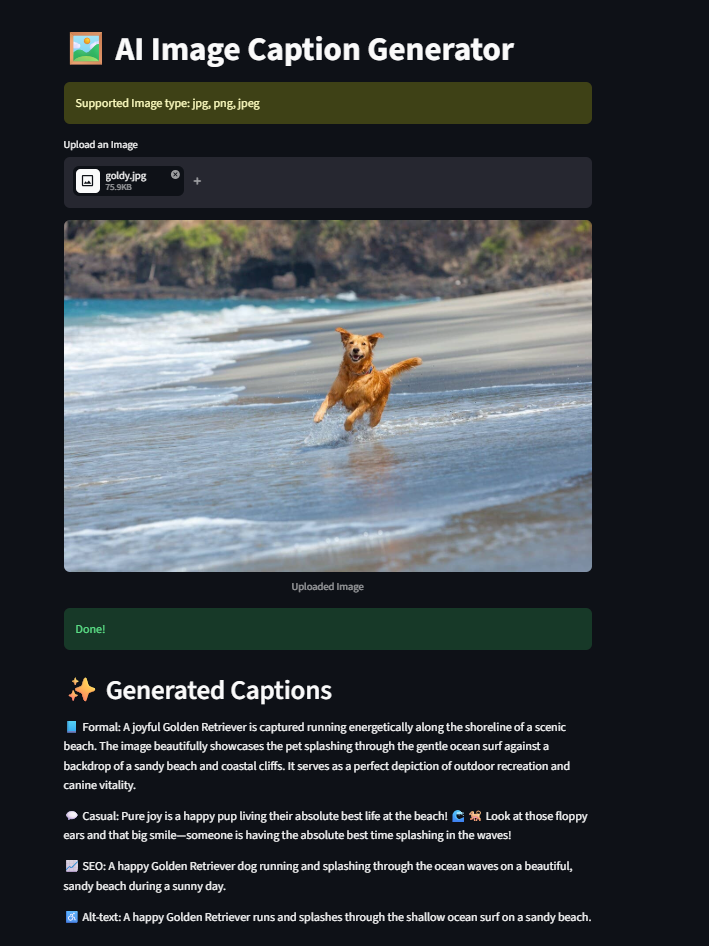

# 🖼️ AI Image Caption Generator

An intelligent web app built with **Streamlit** that generates multiple types of captions for uploaded images using Google's Gemini AI.

---

## ✨ Features

* 📘 **Formal Caption** – Professional, descriptive tone
* 💬 **Casual Caption** – Friendly and conversational
* 📈 **SEO Caption** – Optimized with relevant keywords
* ♿ **Alt Text** – Accessibility-focused description (<125 chars)

---

## 🚀 Demo

Upload any image and instantly get AI-generated captions in multiple styles.
## 🚀 Demo

Upload any image and instantly get AI-generated captions in multiple styles.
---
### 📸 App Preview


---

## 🛠️ Tech Stack

* **Frontend/UI:** Streamlit
* **AI Model:** Google Gemini API
* **Image Processing:** Pillow (PIL)
* **Language:** Python

---

## 📂 Project Structure

```
caption_generating_app/
│
├── app.py               # Main Streamlit app
├── requirements.txt    # Dependencies
├── README.md           # Project documentation
├── .gitignore
└── .env                # (Not uploaded) API key storage
├── assets/                # 📸 Images
│   ├── demo.png           # Main app screenshot
```

---

## ⚙️ Installation & Setup

### 1. Clone the Repository

```
git clone https://github.com/Pawan-145/Caption-Generating-App.git
cd caption_generating_app
```

---

### 2. Create Virtual Environment (Optional but Recommended)

```
python -m venv venv
source venv/bin/activate     # Mac/Linux
venv\Scripts\activate        # Windows
```

---

### 3. Install Dependencies

```
pip install -r requirements.txt
```

---

### 4. Set Up API Key 🔐

Create a `.env` file in the root directory:

```
GEMINI_API_KEY=your_api_key_here
```

> ⚠️ Never upload your `.env` file to GitHub.

---

### 5. Run the App

```
streamlit run app.py
```

---

## 🔑 Environment Variables

| Variable         | Description                |
| ---------------- | -------------------------- |
| `GEMINI_API_KEY` | Your Google Gemini API key |

---

## 🧠 How It Works

1. User uploads an image
2. Image is processed using PIL
3. A structured prompt is sent to Gemini API
4. AI generates:

   * Formal caption
   * Casual caption
   * SEO caption
   * Alt text
5. Results are displayed in a styled UI

---

## 🎨 UI Features

* Image preview before processing
* Loading spinner during generation
* Styled text output with improved readability
* Clean and minimal interface

---

## 🔒 Security Best Practices

* API keys are stored using environment variables
* `.env` is excluded via `.gitignore`
* No sensitive data is exposed in source code

---

## 📌 Future Improvements

* 🌍 Multi-language captions
* 🎯 Custom tone selection
* 📱 Mobile responsiveness
* 💾 Download captions as file
* 🧠 Image tagging & classification

---

## 🤝 Contributing

Contributions are welcome!

1. Fork the repo
2. Create a new branch
3. Make your changes
4. Submit a pull request

---

## 📄 License

This project is licensed under the MIT License.

---

## 🙌 Acknowledgements

* Google Gemini AI
* Streamlit community

---

## 💡 Author

Built by *Pawan Kumar Ray*

---
